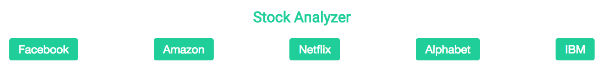
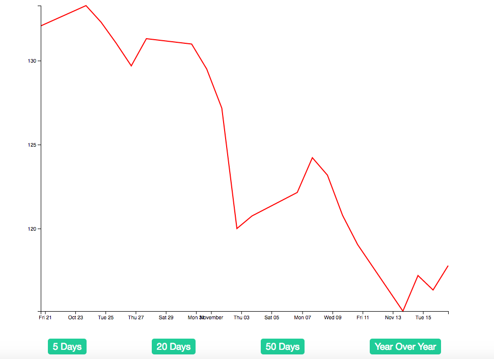
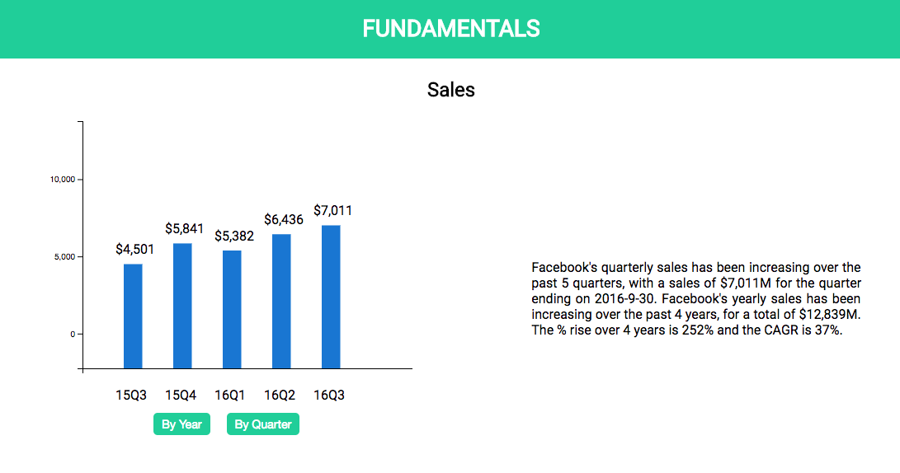

# AlwaysGreen (Stock Analyzer with D3)

[Heroku link] [heroku-link]
[heroku-link]: https://alwaysgreen.herokuapp.com/

## Background
AlwaysGreen is a web app using D3 to show prices, financial ratios and other important metrics for a stock.

## Architecture and Technologies
- Vanilla JavaScript and jQuery for the overall structure
- D3 for data visualization
- NodeJS with Express for receiving and responding to API calls and parsing CSV files

## Features & Implementation

### Select different stocks

User can choose from five different stocks for their detail financial information.

### View price history

The price history is shown in a line graph with dates on the x-axis and prices on the y-axis. User can choose different timeframes to analyze the selected stock's price history of different time periods.

### Explore detailed financial information

The fundamental section includes sales, gross profit, gross profit margin, EBITDA, net income, and earnings per share of the selected stock. User can select "By Year" to view the data for the past 4 years and "By Quarter" for the past 5 quarters. Besides the bar graph generated by D3.js, AlwaysGreen would also generate a small paragraph next to the graph after analyzing the data and calculating the ratios.

## Future Directions for the Project

In addition to the features above, there are a few more bonus features to increase the overall experience of AlwaysGreen.

### NodeJS API to automatically update data
For now, AlwaysGreen only reads from existing JSON and CSV files stored on the server. The next version will automatically fetch API request to third party APIs and get the most updated financial data.

### Interactivity for graphs
The graphs for now are static and does not have any interactivity. The next version will include features for users to get more detailed information of the graphs. For example, a user can hover over the price history chart and a line will appear to align the mouse position to the specific price point. This feature will help a user to view information easily.
